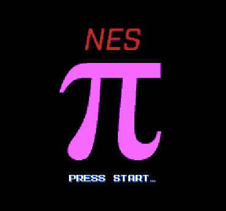

# NesPi

An NES implementation of the ["Pi Spigot" algorithm by
Stanley Rabinowitz and Stan Wagon](https://www.maa.org/sites/default/files/pdf/pubs/amm_supplements/Monthly_Reference_12.pdf). I cover various aspects of the implementation in the [NES Pi video](https://youtube.com/NesHacker) on YouTube.

## Building
The project requires [`ca65`](https://cc65.github.io/) and [`make`](https://www.gnu.org/software/make/) and can be built by running `make` from the project root.

### NTSC Note
In order to fit 960 digits, the game uses nametable realestate that's usually clipped when running on an NTSC screen. This means if you run it on actual hardware or in some emulators, the digits on the top and bottom may be cut off.

## License
MIT
